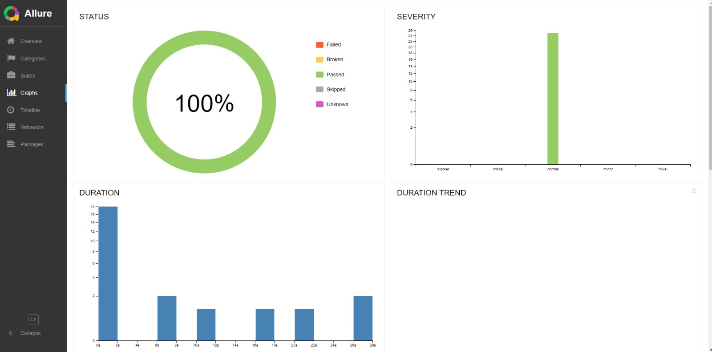
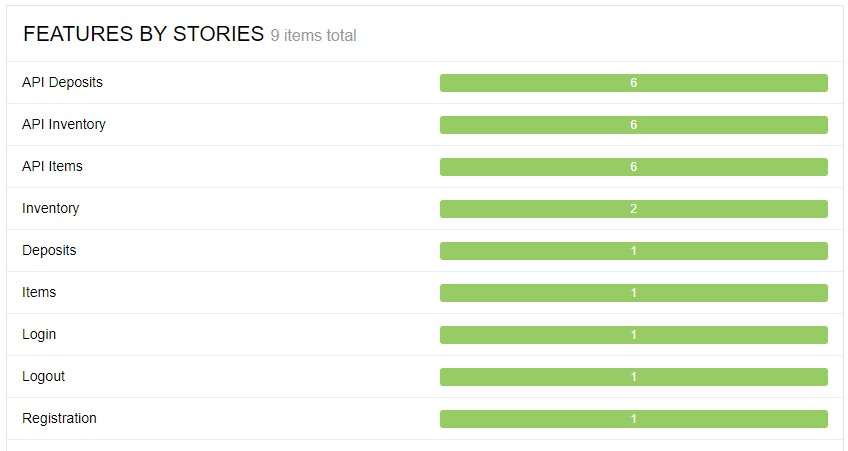

# Automation tests for BEES

## 🚀 Funcionalidades
### Suíte de testes 
* ✔️ Selenium, usado para criar e rodar a automação de testes E2E.
* ✔️ Behave, ferramenta que da suporte ao BDD e utiliza testes escritos na linguagem Gherkin.
* ✔️ Requests, biblioteca para fazer requisições HTTP, utilizada para os testes de API.
* ✔️ Faker, biblioteca permite gerar massa de dados falsos de forma aleatória e realista.
* ✔️ Chrome_options, para rodar os testes em modo headless na pipeline do GitHub Actions.

### Qualidade de código
* ✔️ Pylint, analisador estático do código para encontrar bugs, estilos de codificação questionáveis e construções suspeitas.
* ✔️ Black, ferramenta de regras de formatação para um código consistente.

### CI/CD
* ✔️ [GitHub Actions](https://github.com/thaynaracdutra/bees_automation_test/actions), essa pipeline executa os testes automatizados com Selenium, bahave e também o Pylint para garantir testes funcionando e um código de mais qualidade.
* ✔️ Allure, para gerar relatório dos testes executados.

## 💻 Pré-requisitos para rodar o projeto na sua maquina

* Ter instalado uma IDE de sua preferencia, nesse projeto utilizamos o PyCharm.
* Caso deseje gerar reports em HTML do Allure, você dever ter o JAVA instalado em sua máquina e também o CommandLine Allure. Caso contrário, será possivel gerar apenas o report em .json.

## ⚙️ Configurando o projeto na sua maquina

Inicialmente, você deve clonar o projeto para sua máquina, caso tenha dúvidas de como fazer você pode seguir o passo a passo para clonagem via IDE PyCharm [aqui](https://acervolima.com/como-clonar-um-projeto-da-web-do-github-no-pycharm-usando-o-git/).

Link para clonagem do projeto:
```
git clone https://github.com/thaynaracdutra/bees_automation_test.git
```

Após clonar o repositório para sua máquina você deverá instalar as dependencias do projeto inserindo o comando abaixo no seu terminal:
```
pip install -r requirements.txt
```

## ⚙️ Executando os testes automatizados

Para executar todos os cenários de testes automatizados, basta inserir o comando abaixo:
```
behave
```

Para executar os testes  automatizados gerando reports .json:
```
behave -f allure_behave.formatter:AllureFormatter -o allure-results
```

Para gerar o report HTML, basta rodar o comando abaixo após rodar o comando anterior (lembre-se, conforme dito nos pré-requisitos, é necessário ter o JAVA e o Commandline do Allure):
```
allure serve allure-results
```

Ao finalizar, todos os testes devem ter sido realizados sem falhas.

## 👩🏽‍💻 Evidencia dos testes executados

Evidencia dos testes executados.
<p align="center"></p>
<p align="center"></p>


## 💬 Comentários do autor

* Este projeto conta com a execução via pipeline GitHub Actions, que é executada a cada push e pode ter suas execuções visualizadas [aqui](https://github.com/thaynaracdutra/bees_automation_test/actions).
